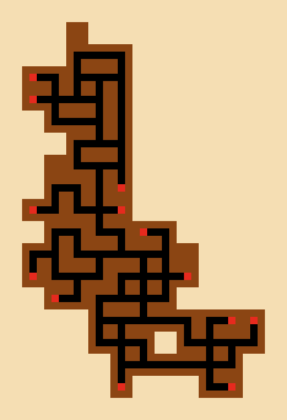

# Bandido simulator

A simulation of the cooperative tile game *Bandido*: players lay 3x6 tunnel cards
around a start card and try to close every open exit before the deck runs out.
Local strategies (random, greedy, compact) and an optional AI player choose
among the legal moves the simulator generates.



## Run

```powershell
pip install -r requirements.txt
python bandido.py --seed 37 --output game.png          # one game, rendered to PNG
python bandido.py --benchmark --games 30 --seed 1      # compare strategies
python bandido.py --validate                           # check the card catalogue
```

Images are cropped to the tunnels; `--full-board` renders the whole grid and
`--png-scale` sets the pixel size. Benchmark on 30 seeded games (2 players, 69 cards):

| strategy | wins | avg open exits left |
|---|---:|---:|
| random | 0/30 | 43.4 |
| greedy | 1/30 | 19.8 |
| compact | 8/30 | 9.5 |

## AI players

`--strategy ai` offers the best-ranked legal moves to a language model through
[book writer](https://github.com/augusto-rehfeldt/book-writer)'s shared AI suite,
like every AI script in this workspace: clone it next to this folder (or set
`BANDIDO_BOOK_WRITER`). The first run asks for provider and model (MiniMax, NVIDIA NIM,
Claude, OpenRouter and the rest) and remembers the pick; keys are configured there (move any
`MINIMAX_API_KEY`/`NVIDIA_API_KEY` from an old `bandido/.env` into book writer's `.env`).
A turn waits at most 30 seconds and never waits out a provider limit.
An invalid or failed reply falls back to the best-ranked move.

## Tests

```powershell
python -B -m unittest -q test_bandido
```

Offline: the shared suite is stubbed. The suite validates the catalogue (edge openings
only at connectors, torches as dead ends), placement, move projection,
strategies, seeded games and PNG rendering.

## License

CC0 1.0. See [LICENSE](LICENSE). Unofficial fan simulation; *Bandido* is a game by
Helvetiq, and this project is not affiliated with or endorsed by them.
